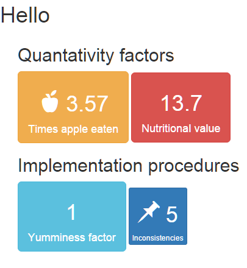

[](https://travis-ci.org/DataStrategist/TileMaker)
[](https://coveralls.io/github/DataStrategist/TileMaker?branch=master)
[](https://saythanks.io/to/DataStrategist)

# TileMaker

An R library that enables the creation of data tiles for inclusion in a
html dashboard or some such.

To install, please type:

    devtools::install_github("DataStrategist/TileMaker", build_vignettes = TRUE)

Please see the [Intro
Vignette](http://datastrategist.github.io/TileMaker/articles/Intro.html)
to learn more about how to do some lovely stuff, but in the meantime,
here's the basics:

This package is intended to "highlight single values", mainly in
dashboards, reports or Shiny apps, and is highly customizeable. This is
what it looks like:



Here's the code that generates the tiles above:

``` r
suppressWarnings(suppressMessages(library(tidyverse,quietly = TRUE)))
library(TileMaker)

a <- solo_box(value = 3, txt = "Little piggies<br>go to the market", icon = "piggy-bank")
b <- solo_gradient_box(value = 65, txt = "test score I got")
c <- solo_gradient_box(value = 95, txt = "test score I wanted")
d <- multi_box(values = c(4, 5, 6), txt = c("Sally", "George", "Mohammed"), icons = c("check", "plus", "calendar"), title = "Candidates")

e <- iris %>%
  group_by(Species) %>%
  summarize(a = mean(Petal.Length)) %>%
  tile_matrix(values = a, txt = Species)

f <- iris %>%
  group_by(Species) %>%
  summarize(a = mean(Petal.Length)) %>%
  mutate(old_a = c(3, 4, 5)) %>%
  tile_matrix(data = ., values = a, txt = Species, former =  old_a)

d1 <- div_maker(subtitle = "First line", textModifier = "h1", a, b)
d2 <- div_maker(subtitle = "Second line", textModifier = "h1", c, d)
d3 <- div_maker(subtitle = "Boom line", textModifier = "h1", e, f)

finisher(
  title = "Important Reportings", 
  css = "https://maxcdn.bootstrapcdn.com/bootstrap/3.3.7/css/bootstrap.min.css",
  file = NULL, 
  textModifier = "h1",
  divs = div_maker(subtitle = "Boom", textModifier = "h2", d1, d2, d3)
)
```